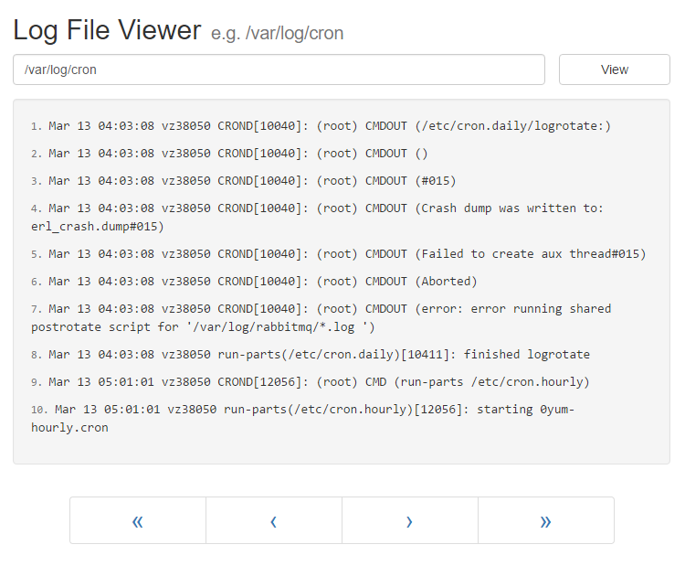

# Log file viewer

A proof of concept web app for viewing server log files.



## Installing

In the root directory of the project run:

```
npm install

node server
```

The app will be served at: http://localhost:9000/	

To run mocha tests use:

```
npm test
```

The front-end part (src/) is pre-built and is served from build/ directory. In case a new build is needed:

```
npm run build
```

## Built With

* [React](https://facebook.github.io/react/) - Front-end JS library
* [Node.js](https://nodejs.org/) - Application server